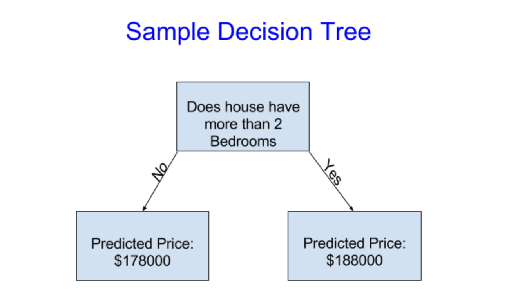
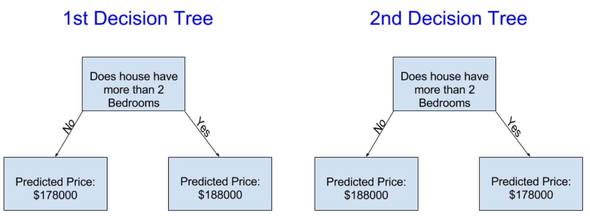
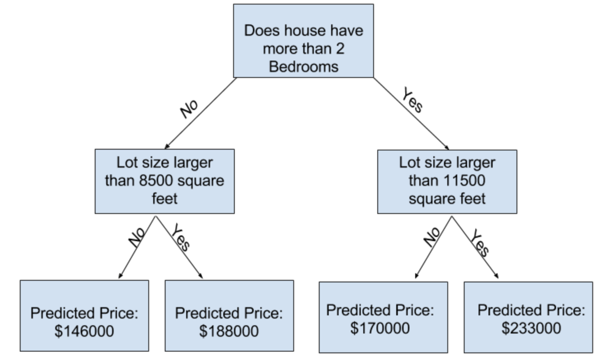

# Teoría básica sobre el funcionamiento de los modelos de aprendizaje automático

# Indice

1. [Introducción](#introducción)
2. [Improving the decision tree](#improving-the-decision-tree)

## Introducción

Vamos a empezar con una vista por encima de cómo funcionan los modelos de aprendizaje automático y cómo son usados. Esto puede sentirse básico si ya has hecho modelos estadísticos o modelos de aprendizaje automático antes. Vamos a progresar para construir poderosos modelos pronto.

Construiremos modelos mientras atravesamos los siguientes escenarios:

Tu primo ha hecho millones de dolares especulando en el mercado inmobiliario. Él se ha ofrecido a convertirse en socios por tu interés en ciencia de datos. Él va a suplir el dinero, y tú vas a aplicar modelos que predigan cuáles o cuántas casas valgan la pena para invertir.

Le preguntas a tu primo cómo ha predecido los valores en el mercado inmobiliario en el pasado, y él responde que es solo intuición. Pero mas preguntas revelan que ha identificado patrones de precios de casas que ha visto en el pasado, y usa esos patrones para hacer predicciones para nuevas casas que considera. 

El aprendizaje automático funciona de la misma manera. Vamos a empezar con un modelo llamado Arbol de decisión. Hay otros modelos que dan predicciónes mas acerdatas. Pero los arboles de decisiónes son fáciles de entender, y son el bloque básico de construcción para los mejores modelos en ciencia de datos.

Por simplicidad, vamos a empezar con el arbol de decisión mas simple posible.

Divide las casas en solo dos categorias. El precio predicho para cualquier casa bajo consideración es el precio medio historico de casas en la misma categoria.

Usamos data para decidir como dividir las casas en dos grupos, y determinar el precio predicho en cada grupo. Este paso de capturar patrones a partir de datos es llamado ***Fitting*** o ***Entrenar al modelo***. La data usada para entrenar al modelo es llamada ***Training data***.

Los detalles de cómo el modelo es entrenado (por ejemplo, como dividir los datos) es complejo todavía, por lo cual lo vamos a dejar para después. Después de que el modelo ha sido entrenado, puedes aplicarlo en nuevos datos para predecir precios de casas adicionales.

## Improving the Decision tree

¿Cuál de estos dos arboles de decisión parece resultar mejor para entrenar datos del mercado inmobiliario?

El arbol de decision a la izquierda (Decision Tree 1) probablemente tiene mas sentido, porque captura la realidad que las casas con mas habitaciones tienden a venderse a precios mas elevados que las casas con menos. El mayor fallo de este modelo es que no captura todos los factores que afectan al precio de una casa, como el número de baños, el tamaño del lote, la ubicación, etc.

Podemos capturar mas factores usando un arbol que tenga mas "splits". Estos son llamados "Deeper" trees (Arboles mas profundos, en su traducción). Un arbol de decisión que también considra el tamaño total del lote de cada casa podría verse de la siguiente manera:

Tú predicción del precio de algúna casa siguiendo el arbol de decisión, siempre toma el camino que corresponde a las caracteristicas de la casa. El precio predicho para la casas está en la parte de abajo del arbol. El punto abajo del arbol donde hacemos la predicción, es llamado una "Leaf".

Estas divisiones y valores en las hojas van a ser determinadas por los datos, asi que es tiempo de mirar los datos con los que vamos a estar trabajando.

