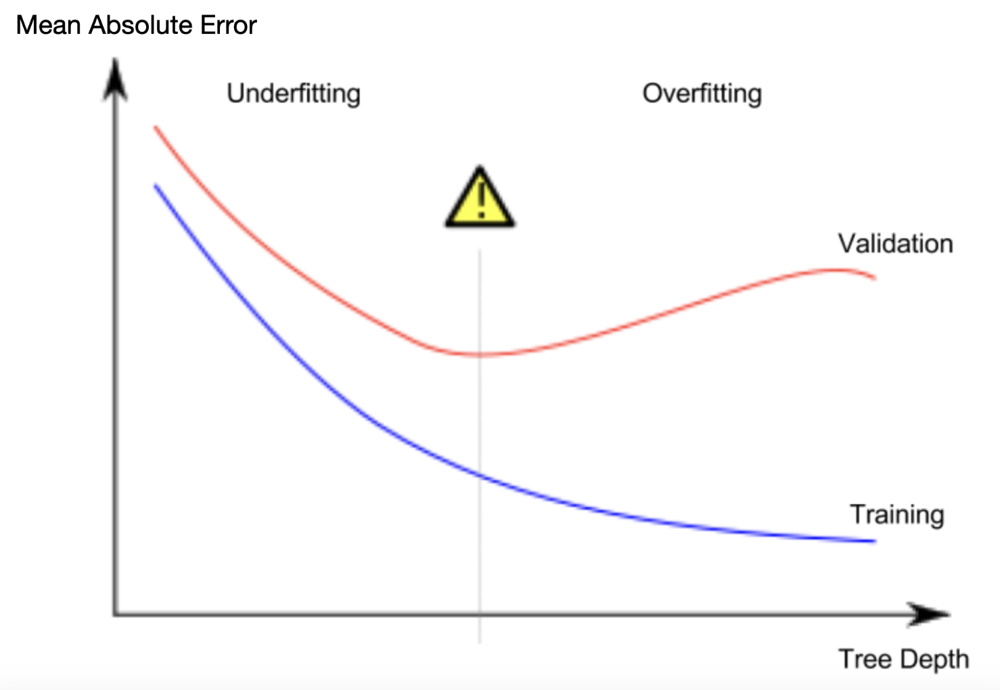

# Teoría básica sobre el overfitting y underfitting de modelos de aprendizaje automático

En esta sección estará la teoría vinculada al archivo de práctica: [Underfitting and overfitting](./uf-ov.py)

## Indice

1. [Introducción](#experimenting-with-different-models)
2. [Ejemplo](#example)
3. [Conclusión](#conclusión)

## Experimenting with different models

Ahora que tenemos una forma confiable de medir la precision de nuestros modelos, podemos experimentar con modelos alternativos y mirar cual nos da las mejores predicciones. ¿Pero qué alternativas tenemos para modelos?

Podemos ver en la [documentación](https://scikit-learn.org/stable/modules/generated/sklearn.tree.DecisionTreeRegressor.html) de scikit-learn que el modelo de arbol de decision tiene varias opciones (mas de las que vamos a querer o necesitar por un largo tiempo).
Lo opciones mas importantes determinan la profundidad del arbol. Recordemos de la primera documentación que la profundidad de un arbol es una medida de cuantas divisiones hace antes de hacer alguna prediccion. Esto es una profundidad relativamente baja.

<div style="margin-bottom: 10px;">

</div>

En la práctica, no es poco común para un arbol tener 10 divisiones entre el nivel mas alto (todas las casas) y una hoja. Mientras el arbol se vuelve mas profundo, el set de datos se divide en hojas con menos casas. Si un arbol solo tiene 1 division, los datos se dividen en 2 grupos. Si cada grupo es dividido otra vez, podríamos tener 4 grupos de casas. Dividiendo cada una de nuevo, crearíamos 8 grupos. Si continuamos duplicando el numero de grupos añadiendo mas divisiones en cada nivel, vamos a tener 2 elevado a 10 grupos de casas para el momento que lleguemos al nivel 10. Esas son 1024 hojas.

Cuando dividimos las casas entre varias hojas, también tenemos menos casas en cada hoja. Las hojas con muy pocas casas van a hacer predicciones que son bastante cercanas a esos valores actuales de las casas, pero pueden hacer predicciones muy inseguras para nuevos datos (porque cada prediccion se basa en solo unas pocas casas).

Este es un fenomeno llamado overfitting, donde un modelo se ajsusta al conjunto de datos casi perfectamente, pero se comporta de manera ineficiente en una validacion o con nuevos datos. Por el otro lado, si hacemos un arbol demasiado superficial (poca profundidad), no va a dividir las casas en grupos muy distintos. 

En un extremo, si un arbol divide casas en solo 2 o 4, cada grupo todavía va a tener una amplia variedad de casas. Las predicciones resultantes pueden estar muy alejadas de la mayoría de casas, incluso en los datos de entrenamiento (y serían malas en la validacion por la misma razón). Cuando un modelo falla en capturar importantes distinciones y patrones en los datos, entonces se comporta bastante mal incluso en los datos de entrenamiento, es llamado underfitting. 

Una vez que sabemos sobre la precisión en nuevos datos, que estimamos desde nuestros datos de validacion, queremos encontrar el punto de equilibrio entre underfitting y overfitting. Visualmente, queremos encontrar el punto mas bajo de (rojo) la curva de validación en la figura de abajo.

<div style="margin-bottom: 10px;">

</div>


## Example

Hay pocas alternativas para controlar el nivel de profundidad de un arbol, y algunas permiten para algunas rutas en el arbol el tener mayor profundidad que otras rutas. Pero el argumento ```max_leaf_nodes``` provee una forma muy sensible para controlar overfitting vs underfitting. Mientras mas hojas le permitamos crear al arbol, más nos vamos a mover desde el área de underfitting hacia el área de overfitting en el gráfico que ya vimos. 

Podemos usar una funcion de utilidad para ayudar a comparar el puntaje MAE de diferentes valores para ```max_leaf_nodes```:
```python
from sklearn.metrics import mean_absolute_error
from sklearn.tree import DecisionTreeRegressor

def get_mae(max_leaf_nodes, train_X, val_X, train_y, val_y):
    model = DecisionTreeRegressor(max_leaf_nodes=max_leaf_nodes, random_state=0)
    model.fit(train_X, train_y)
    preds_val = model.predict(val_X)
    mae = mean_absolute_error(val_y, preds_val)
    return(mae)
```

Podemos usar un búcle for para comparar la precision de modelos construidos con diferentes valores para max_leaf_nodes.
```python
for max_leaf_nodes in [5, 50, 500, 5000]:
    my_mae = get_mae(max_leaf_nodes, train_X, val_X, train_y, val_y)
    print("Max leaf nodes: %d  \t\t Mean Absolute Error:  %d" %(max_leaf_nodes, my_mae))

# Salida: 
# Max leaf nodes: 5  		 Mean Absolute Error:  347380
# Max leaf nodes: 50  		 Mean Absolute Error:  258171
# Max leaf nodes: 500  		 Mean Absolute Error:  243495
# Max leaf nodes: 5000  		 Mean Absolute Error:  254983
```
De estas opciónes, la de 500 es el número óptimo de hojas. 

## Conclusión
Esta es la idea clave: Los modelos pueden sufrir de ámbos:

Overfitting: Capturar patrones irrelevantes que no se repiten en el futuro, llevando a predicciones menos acertadas, o
Undefitting: Fallar al capturar patrones relevantes, otra vez llevando a predicciones menos acertadas.
Usamos los datos de validaciones, los cuales no son usados en el entrenamiento del modelo, para medir la precisión de un modelo candidato. Esto nos permite intentar muchos modelos y mantener el mejor de ellos. 